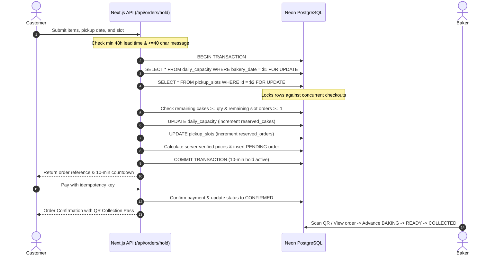

# 🎂 CakeCart — Production-Ready Home-Bakery Platform

A production-ready, artisan home-bakery ordering web application engineered with daily capacity limits, precision pickup slots, 40-character custom cake message piping, 48-hour minimum lead times, and a baker operations dashboard. Built for high-volume serverless deployment on **Vercel** with **Neon Serverless PostgreSQL** and **Drizzle ORM**.

---

## 🌟 Architecture & The Three Agents

CakeCart was engineered by the **CakeCart Team** comprised of three specialized agents:

1. **Agent 1 — App Agent**:
   - Built a responsive, artisan bakery ordering interface in Next.js 15 (App Router) and Tailwind CSS with warm cream, amber, and rich espresso aesthetics.
   - Pages: Home, Menu with dynamic multi-criteria filters (categories, dietary tags, flavours, portion sizes, price sorting), Cake Customiser workshop with live 40-char calligraphy preview, Cart, Checkout with 10-minute capacity hold timer, Order Confirmation with QR collection pass, My Orders with 24-hour cutoff rule, Login/Register, and Baker Operations Dashboard.
   - Enforced client-side 48-hour minimum lead time and 40-character custom message validation with micro-animations.

2. **Agent 2 — Database Engine Agent**:
   - Designed PostgreSQL schema with Drizzle ORM across 14 tables with UUID primary keys, UTC timestamps, and integer minor units (cents) for currency.
   - Check constraints: `reserved_cakes <= max_cakes`, `reserved_cakes >= 0`, `reserved_orders <= max_orders`, `char_length(custom_message) <= 40`.
   - Atomic 10-Step Order Hold Transaction with row-level locks (`SELECT ... FOR UPDATE`).
   - Idempotent expired hold release cron endpoint (`/api/cron/release-holds`) protected by `CRON_SECRET`.
   - Seeding script provisioning 14 days of capacity, pickup slots, 8 artisan cakes, sizes, flavours, and demo accounts.

3. **Agent 3 — QA Agent**:
   - Engineered automated test suite (`tests/run-all-tests.ts`) executing 32 automated test assertions.
   - Concurrency & race condition test: 2 simultaneous order holds for the last remaining cake capacity; verified exactly 1 succeeds, 1 is rejected, and `reserved_cakes` never exceeds `max_cakes`.
   - Verified 48-hour lead time and closed date server rejection, payment idempotency, expired hold cleanup, and 24-hour cutoff customer cancellations.
   - Validated Next.js production build (`npm run build`) passing with all 25 static & dynamic routes compiled.

---

## 🚀 Quick Start & Local Setup

### 1. Prerequisites
- Node.js 18+ (Node 24 LTS verified)
- npm or pnpm

### 2. Installation
```bash
git clone <repo-url>
cd "Cake 23"
npm install
```

### 3. Environment Variables
Copy `.env.example` to `.env.local`:
```bash
cp .env.example .env.local
```

| Variable | Description |
|---|---|
| `DATABASE_URL` | Neon PostgreSQL pooled connection string (`sslmode=require`) |
| `DIRECT_URL` | Unpooled Neon PostgreSQL connection string for migrations |
| `AUTH_SECRET` | 32+ character secret for signing httpOnly session JWTs |
| `CRON_SECRET` | Secret token protecting `/api/cron/release-holds` |
| `BLOB_READ_WRITE_TOKEN` | Vercel Blob token for cake photos and reference images |
| `PAYMENT_PROVIDER` | `test_gateway` (built-in test mode with 1-click test cards) |

> **Offline/Local Development Note**: CakeCart includes an embedded PostgreSQL engine (`@electric-sql/pglite`) fallback. If no external `DATABASE_URL` is set, migrations, seeding, and tests run out of the box with zero external dependencies!

### 4. Database Migrations & Seeding
```bash
# Seed 14 days capacity, pickup slots, 8 artisan cakes, and demo users
npm run db:seed
```

### 5. Running the QA Test Suite
```bash
npm run test:qa
```
Output:
```
=================================================
🎉 CakeCart QA Suite Complete! Passed: 32, Failed: 0
=================================================
```

### 6. Starting Development Server
```bash
npm run dev
```
Open [http://localhost:3000](http://localhost:3000).

---

## 👥 Demo User Accounts

| Role | Email | Password | Permissions |
|---|---|---|---|
| **Baker Staff** | `baker@cakecart.com` | `BakeryPass123!` | Access `/baker` dashboard, set capacity, close dates, advance status |
| **Customer** | `customer@cakecart.com` | `BakeryPass123!` | Place orders, view `/my-orders`, cancel eligible orders (>24h notice) |

*Both login buttons feature 1-click test auto-fill on `/login`.*

---

## 🔒 The 10-Step Order Hold Transaction



---

## 🌐 Deploying to Vercel

1. **Push your repository** to GitHub.
2. In the [Vercel Dashboard](https://vercel.com):
   - Import your CakeCart project.
   - Under **Storage / Integrations**, add **Neon Serverless Postgres** via the Vercel Marketplace. This automatically configures `DATABASE_URL` with connection pooling enabled.
   - Under **Storage**, add **Vercel Blob** to obtain `BLOB_READ_WRITE_TOKEN`.
3. Set your Production Environment Variables:
   - `AUTH_SECRET`: Generate a secure random string (`openssl rand -hex 32`)
   - `CRON_SECRET`: Generate a random cron secret
4. **Deploy**:
   - Vercel automatically runs `next build`.
   - Vercel Cron executes `/api/cron/release-holds` every 5 minutes to safely recycle uncompleted capacity holds.
5. In Vercel deployment settings, add the post-deploy command or run `npm run db:seed` once to populate initial artisan cakes and slots.

---

## 📜 Database Rules Summary

- **UUID Primary Keys**: `gen_random_uuid()` used on all 14 tables.
- **Integer Minor Units**: All monetary values stored as cents (`base_price`, `unit_price`, `total_price`, `message_fee`, `amount`).
- **Check Constraints**:
  - `reserved_cakes <= max_cakes`
  - `reserved_cakes >= 0`
  - `reserved_orders <= max_orders`
  - `char_length(custom_message) <= 40`
- **Order Status Pipeline**: `PENDING` ➔ `CONFIRMED` ➔ `BAKING` ➔ `READY` ➔ `COLLECTED` (or `CANCELLED`, `EXPIRED`, `REFUNDED`).
- **Separate Payment State**: Stored in `payments` table with `idempotency_key` unique index.
